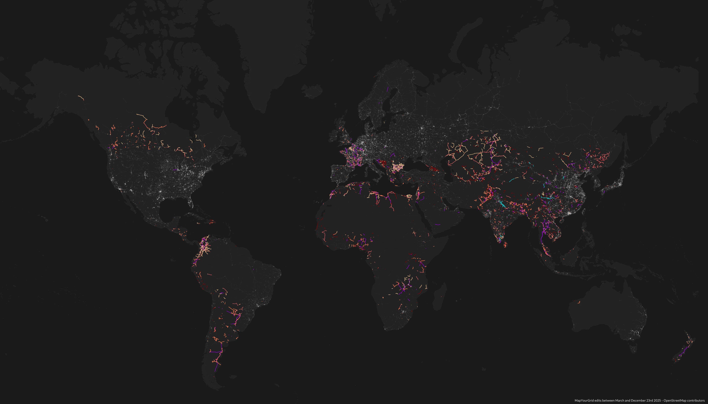

<h1>Progress</h1>

</a> 
<figcaption class="image-caption"> All the lines created and edited by MapYourGrid</b> mappers. Click to enlarge.
</figcaption>

MapYourGrid measures its progress at user, hashtag and country level. We would be honoured to make your progress part of the initiative. If you use our tools and training courses please use the #MapYourGrid hashtag in your changesets. If you would like to contribute to our development or keep up to date with our progress, take a look at our public [organization project management](https://github.com/orgs/open-energy-transition/projects/25/views/7) and [roadmap](https://github.com/orgs/open-energy-transition/projects/25/views/13). 

Our initiative primarily focuses on improving data coverage in low- and middle-income countries worldwide. We are also working to improve data quality. To learn more about our quality improvement strategies, please visit our [Strategies](strategies.md) page.

We have also developed [Grid Inspector](gridinspector.md), a pionneering platform dedicated to the analysis and comparison of OSM power data quality.

     <a href="#countries" class="btn btn-primary">
      Country list 🌐
     </a>
      <a href="#community-mapping-progress" class="btn btn-primary">
        Community Mapping Progress 👥
      </a>
      <a href="#line-length-growth-per-country" class="btn btn-primary">
        Line Length Growth per Country 📈
      </a>
      <a href="#interconnectors" class="btn btn-primary">
        Interconnectors ⚡
      </a>

<!-- Countries Section -->
## **
Countries 🌐
**

Our work improves access to high-quality data on power generation and transmission infrastructure worldwide. In the countries below, we have contributed to mapping and filling critical gaps in the power grid.

  

    <a href="/countrypages/Bangladesh/">
      
       Bangladesh
    </a>
  

  

    <a href="/countrypages/Benin/">
      
       Benin
    </a>
  

  

    <a href="/countrypages/Bolivia/">
      
       Bolivia
    </a>
  

  

    <a href="/countrypages/Bosnia%20and%20Herzegovina/">
      
       Bosnia and Herzegovina
    </a>
  

  

    <a href="/countrypages/Bulgaria/">
      
       Bulgaria
    </a>
  

  

    <a href="/countrypages/Cambodia/">
      
       Cambodia
    </a>
  

  

    <a href="/countrypages/Colombia/">
      
       Colombia
    </a>
  

  

    <a href="/countrypages/Georgia/">
      
       Georgia
    </a>
  

  

    <a href="/countrypages/Kazakhstan/">
      
       Kazakhstan
    </a>
  

  

    <a href="/countrypages/Kenya/">
      
       Kenya
    </a>
  

  

    <a href="/countrypages/Mongolia/">
      
       Mongolia
    </a>
  

  

    <a href="/countrypages/Nepal/">
      
       Nepal
    </a>
  

  

    <a href="/countrypages/Nigeria/">
      
       Nigeria
    </a>
  

  

    <a href="/countrypages/Pakistan/">
      
       Pakistan
    </a>
  

  

    <a href="/countrypages/Sri%20Lanka/">
      
       Sri Lanka
    </a>
  

  

    <a href="/countrypages/Turkmenistan/">
      
       Turkmenistan
    </a>
  

  

    <a href="/countrypages/Uganda/">
      
       Uganda
    </a>
  

  

    <a href="/countrypages/Uzbekistan/">
      
       Uzbekistan
    </a>
  

<!-- Progress Bars Section -->
## **
Community Mapping Progress 👥
**

  

    <a href="https://mapyourgrid.infos-reseaux.com/dashboard/" target="_blank">
      
       MapYourGrid progress dashboard
    </a>
  

  

    <a href="https://stats.now.ohsome.org/dashboard#hashtag=MapYourGrid&start=2025-03-12T22:00:00Z&end=2025-05-14T21:59:59Z&interval=P1M&countries=&topics=" target="_blank">
      
       Ohsome Nowstats
    </a>
  

 
   <button id="refresh-btn" style="margin-bottom:1rem;">
     🔄 Refresh stats (only click if the bars are not "loading...")
   </button>

  

    <label>Contributors mapping with <code>#MapYourGrid</code> hashtag:</label>
    
 

 

    Loading…
  

  

    <label>Total Edits for <code>#MapYourGrid</code> hashtag:</label>
    

      

 

    Loading…
  

  

    <label>Total estimated power towers added by mappers of the MapYourGrid organisations:</label>
    

      

    

    Loading…
     
    Last updated: —
  

  

    <label>Total estimated length of power lines added by mappers of the MapYourGrid organisations:</label>
    

      

    

    Loading… 
    
      Last updated: —
    
  

  

    <label>Total Estimated Global Power Capacity added/edited by mappers of the MapYourGrid organisations:</label>
    

      

    

    Loading…
     
    Last updated: —
  

  

    <label>Total estimated substations added/edited by mappers of the MapYourGrid organisations:</label>
    

      

    

    Loading…
     
    Last updated: —
  

  

    <label>Total estimated power towers added by people using the <code>#MapYourGrid</code>:</label>
    

      

    

    Loading…
     
    Last updated: —
  

  

    <label>Total estimated length of power lines added by people using the <code>#MapYourGrid</code>:</label>
    

      

    

    Loading… 
    
      Last updated: —
    
  

<!-- Progress bars script------------------------------------------------- -->

<!-- Progress bars script------------------------------------------------- -->

??? success "Top #mapyourgrid Community Mappers Leaderboard"
    **This is a leaderboard of the top 10 community mappers of power towers who used our hashtag in their changesets.**  
    :exclamation: **Grid quality, substations and power plants are as important as tower coverage!**
    

            
Loading leaderboard...

    

    

Want to calculate your own progress? Check out this [web interface](https://open-energy-transition.github.io/KPI-OSM/) where you can calculate the number of towers/poles you placed in a country, substations edited, and total MW capacity you added to a country.

## **
Line Length Growth per Country 📈
**

The following table shows the **total growth in line length across all OpenStreetMap edits** worldwide, calculated using pre-processed statistical data of [Podoma](https://wiki.openstreetmap.org/wiki/Podoma). See it directly online on <a href="https://mapyourgrid.infos-reseaux.com/dashboard/#tables" target="_blank">this dedicated dashboard</a>.

<iframe src="https://mapyourgrid.infos-reseaux.com/dashboard/#tables" width="100%" height="600px" style="border:none;"></iframe>

<!-- Countries Section -->
## **
Interconnectors ⚡
**

The #MapYourGrid team is continuously improving the mapping of international connectors. The map below shows the interconnectors that the team has worked on.

</td>

