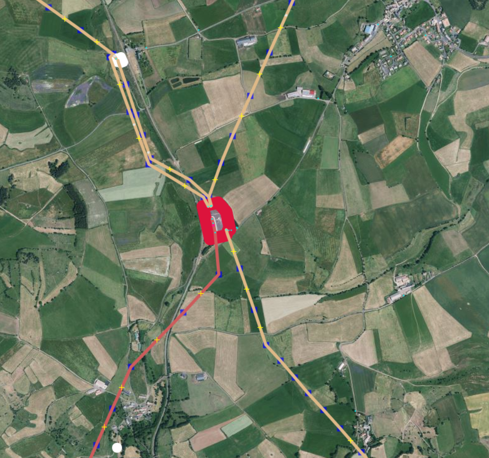

<h1>Starter Kit🌱 </h1>

Your beginner-friendly guide to mapping transmission power grids in OpenStreetMap with JOSM.

## 
First thing's first : Get familiar with OSM and set up JOSM
</h3>

## **
#1 Get started with OpenStreetMap and Open Infrastructure Map  
**

Before mapping power infrastructure, get familiar with OpenStreetMap (OSM):

1. Create an OSM account. [Sign up here](https://www.openstreetmap.org/user/new). 
2. Learn basic mapping with the in-browser editor (iD) :
    - Visit the [OpenStreetMap Wiki](https://wiki.openstreetmap.org).
    - Use the [iD Beginners' Guide](https://learnosm.org/en/beginner/id-editor/) to get starter. 
    - Start small. Add missing streets, parks, buildings in your area. 
3. Find missing power infrastructure near you. 
    - Go to [Open Infrastructure Map](https://openinframap.org/).
    - Click "Find my location" on the top right corner, or search your city. 
    - See a missing line or substation nearby ? Map it ! Use the iD editor. 
    - Check detailed mapping guidelines in the OSM Wiki. 
    
Even small edits like missing towers or bits of power lines make a big difference by helping others complete the grid. Don't worry about making mistakes. Mapping is an iterative process, and the OpenStreetMap community can detect anything that is missing or wrongly tagged.
    
The OpenStreetMap Wiki pages [The Power Network](https://wiki.openstreetmap.org/wiki/Power_networks) and [Key:Power](https://wiki.openstreetmap.org/wiki/Key:power) provide an overview of how to map different power infrastructure.

  
  <figcaption class="image-caption">Open infrastructure map showing the highly detailed transmission and distribution grid in Portugal.</figcaption>

!!! note
    **⚠️ In some countries, mapping power lines is restricted. Always verify local guidelines, connect with the OSM local community first, or check out the [local projects](https://wiki.openstreetmap.org/wiki/Power_networks).** 
    **⚠️By following our [Code of Mappers](./code-of-mappers.md), we collectively protect the integrity of the OSM platform, foster trust with communities, and unlock the power of open data for a more resilient and just energy future.** 
    
## **
#2 Install JOSM for a more advanced mapping 
** 

JOSM is the desktop editor we recommend for grid mapping.

!!! note
    The JOSM Preferences window is accessed through the `Edit → Preferences` menu on Windows and Linux, and `JOSM → Settings` on Mac.

  
  <figcaption class="image-caption">Default OhmyGrid Presets in JOSM toolbar. Click to enlarge.</figcaption>

1. Install [Java](https://www.java.com/en/download/help/download_options.html) on your device.  
2. Install [JOSM](https://josm.openstreetmap.de/). Further instructions can be found at [learnOSM](https://learnosm.org/en/josm/start-josm/). 
3. Link your OSM account to JOSM. Go to `Preferences → OSM Server` and select "Authorise". Login with your OSM account. Be aware that your token is now stored in your local preferences.xml file. Do not share this file with anyone.  
4. Activate "Expert mode" in `View → Expert mode`. This will enable using Overpass API.  
5. Enable "Remote control" in `Preferences → Remote Control`. This allows for grid data to be loaded automatically.
6. (Optional) We recommend using preconfigured preferences. Download this preferences.xml [file](https://github.com/open-energy-transition/grid-mapping-starter-kit/blob/main/josm-config/preferences.xml). Check the [JOSM wiki](https://josm.openstreetmap.de/wiki/Help/Preferences) on where to place it.<!-- No space here --> 
7. Download this <a href="https://github.com/open-energy-transition/grid-mapping-starter-kit/blob/main/josm-config/transmission_grid_mapping_template.joz" target="_blank">template</a> session on your devis. In JOSM, go to `File → Open` and select the .joz file.  
8. Understanding JOSM layers. JOSM works with stacked layers, similar to Photoshop or GIS tools:
    - You’ll typically have an OSM data layer, imagery layers, and optionally GeoJSON or task layers.
    - You can switch between multiple satellite imagery sources (for instance, Esri, Mapbox) to use the clearest one for your area.

    

  
  <figcaption class="image-caption">Default OhmyGrid Presets in JOSM toolbar. Click to enlarge.</figcaption>

**Optional step for a faster mapping experience :**  
Customise your top toolbar with presets. Right click the toolbar and choose `Configure toolbar → Presets → Man Made → Man Made/Power` and add power towers, power substations, power lines, power portals. You can adjust the presets later on according to what you are using the most.
    
## **
#3 Add visual clarity with custom map styles :art:
**

  
  <figcaption class="image-caption">OhmyGrid legend for transmission grid mapping. Click to enlarge.</figcaption>

 
1. In JOSM, go to `Preferences → Map Paint Styles` and press the "+" in the top right.
2. Paste this [URL](https://raw.githubusercontent.com/open-energy-transition/color-my-grid/refs/heads/main/ohmygrid-default.mapcss), or download the raw [file](https://github.com/open-energy-transition/color-my-grid/blob/main/ohmygrid-default.mapcss) on your device, and add it.
3. Make sure the style is active in the Map Paint Styles menu. 

**Optional steps for an even better visual experience :** 
    - Not all grids are made the same. Use this MapCSS file for [low-density grids](https://raw.githubusercontent.com/open-energy-transition/color-my-grid/refs/heads/main/ohmygrid-default.mapcss), or this one for [high-density grids](https://raw.githubusercontent.com/open-energy-transition/color-my-grid/refs/heads/main/ohmygrid-default.mapcss).  
    - Check [ColorMyGrid](https://github.com/open-energy-transition/color_my_map), our MapCSS Generator tool, to easily adapt the MapCSS file to your needs. The raw data to edit the [map legend](https://raw.githubusercontent.com/open-energy-transition/color-my-grid/refs/heads/main/legend/power-grid-legend.png) is in the ColorMyGrid repo.  

## 
 Everything is set up ! Let's map ! 
</h3>

## **
#1 Load the power grid into JOSM to start mapping :inbox_tray:
**

  
  <figcaption class="image-caption">This is a highlighted substation on OpenStreetMap, with multiple lines leading away from it.</figcaption>

1. Head to the [Map it! page](https://ohmygrid.org/map-it/) and follow the mini-tutorial there. 
2. Select a country or a region. This will automatically open JOSM with the grid data loaded. 
3. Select Default Transmission (90kV+) to load high-voltage infrastructure data.  
4. Check our [Tools and strategies! page](https://ohmygrid.org/tools/) for more information on how and what to map.

## **
#2 Let's map ! 
**

**Here are some mapping tips :** 
1. Draw lines and place nodes (A key), select objects (S key) and apply the correct tags and keys (Attributs sidebar or Presets sidebar). 
2. Example : Upon finding a substation that is not already mapped, place nodes in a rectangle, connect them to create a polygon (area). Add the correct attribute power=substation. 

   
  <figcaption class="image-caption">Selecting all the finished notes in a line enables you to quickly turn them into Power Towers.</figcaption>

**Tip :** When mapping a line, you can tag all untagged nodes at once. Use `Control+F` to open up search. Type in `child selected type:node AND untagged`. This will select all untagged nodes of the way and tag them as power=tower. 

## **
#3 Avoid these common mistakes :name_badge:
**
Mapping is an iterative process and mistakes happen. This should not stop you from mapping; simply map what you can verify based on your skillset. If a tower, lines or attributes are missing, our quality assurance tool Osmose will automatically detect this.

1. Our tools focus on transmission grids, that’s why you don’t see lines below 90 kV. To see already mapped lines below 90 kV or lines tagged with power=minor_line, download the whole area you’re working on with the green arrow pointing down.
2. When mapping, make sure to not go across the border of the country you’re working on (visible dashed orange lines). Otherwise, you may find yourself mapping something that already exists, but hasn’t been downloaded in JOSM.
3. Don’t map beyond your expertise. If unsure, leave it for experienced mappers or locals, make a fixme note, or ask the community !

For a safe mapping, we recommend you reading about [good practices](https://wiki.openstreetmap.org/wiki/Good_practice).

## **
#4 Upload your work :outbox_tray: 
**

1. Click the green upload arrow in JOSM.
2. JOSM lets you know about any validation warnings. Adress them as best as you can. A "Missing line support node" can be ignored if imagery is not sufficient.
3. Include `#ohmygrid` or `#mapyourgrid` in your changeset comment to support the initiative.

## **
What else ? Learn the grid basics 
**
You don’t need to be a grid expert to start mapping, but a little knowledge helps!
The following documents and materials will give you a basic understanding of how to map an electrical grid.

The [Learning Curve](https://www.youtube.com/@TheLearningCurveBenila/videos),is a youtube channel that provides multiple videos that will help you understand the basics of the electrical grid needed for grid mapping:

1. [Electrical Line Supports - Transmission Towers & Poles](https://www.youtube.com/watch?v=AB1qYsiDm0M)
1. [Components of Overhead Transmission Lines](https://www.youtube.com/watch?v=A6fwq3yHRXQ)
1. [Comparison between HVAC and HVDC transmission system](https://www.youtube.com/watch?v=l9nHs8e0WUg)

The following image is take from the report Key technology components of electricity grids Source: IEA - [Electricity Grids and Secure Energy Transitions](https://iea.blob.core.windows.net/assets/ea2ff609-8180-4312-8de9-494bcf21696d/ElectricityGridsandSecureEnergyTransitions.pdf).

  
  <figcaption class="image-caption">Key technology components of electricity grids Source: IEA - Electricity Grids and Secure Energy Transitions.</figcaption>

## 
Do you have more questions?

Maybe you will be able to find an answer on our [Q&A page](q&a.md).

## Join the Chat  {.tools-header style="font-weight:700"}
You are very welcome to join our [community chat](https://discord.gg/a5znpdFWfD) called _📍-ohmygrid_ on the PyPSA-Earth discord channel. Here you can ask questions, and interact with the community. For mapping specific questions and to participate in our free personalized training, please join our [📍-ohmygrid-support-and-training](https://discord.gg/fBw7ARTUeR) channel. 

## 
Join the Community  :calendar: 

Join our community calls and tutorials to learn more about the mapping process and the initiative.
<iframe src="https://calendar.google.com/calendar/embed?height=600&wkst=1&ctz=Europe%2FBerlin&showPrint=0&title=Community%20live%20sessions&src=Y182ODE3NjE1MGIzMjY4MGRkZmUzMGM1ZTE1MDU0YTc5MTVhMzY2NmY1OGY5NjkxOGVjOTZhNDJjZWQwODQ2ZGVmQGdyb3VwLmNhbGVuZGFyLmdvb2dsZS5jb20&color=%23AD1457" style="border:solid 1px #777" width="800" height="600" frameborder="0" scrolling="no"></iframe>
