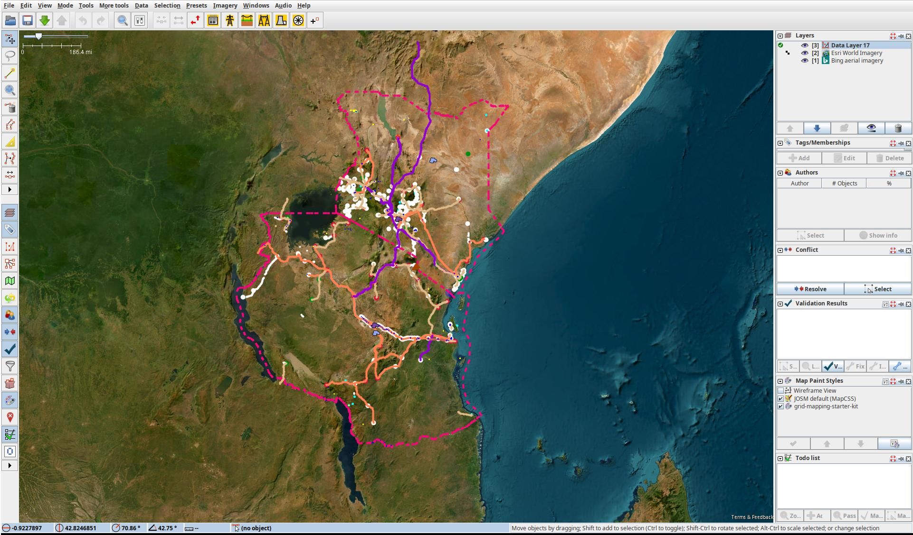

<h1>Starter-Kit🌱</h1>

This starter kit for mapping the electrical transmission grid in OpenStreetMap outlines the basic skills required. If you ever get stuck with the Starter Kit or would like to provide feedback, please contact us via our [community chat](https://discord.gg/fBw7ARTUeR) or <a href="mailto:MapYourGrid@openenergytransition.org" target="_blank" rel="noopener"> via email</a>. A MapYourGrid member will help you finish your first line and set up your environment.

## **
1. Get started with OpenStreetMap and Open Infrastructure Map  
**

If you don't already have an OpenStreetMap account, [create one first](https://www.openstreetmap.org/user/new). If you're new to OpenStreetMap, now is a good time to learn the basics of editing using the in-browser editor (iD) - find something which is missing from the map in your local area and add it! The [OpenStreetMap Wiki](https://wiki.openstreetmap.org) has lots of information about how to map with OpenStreetMap, and you can start by reading the [iD Beginners' Guide](https://learnosm.org/en/beginner/id-editor/). Adding missing power towers or substations can significantly improve mapping progress, as it gives other mappers a clue as to where parts of the entire grid are missing. To quickly check if anything is missing near you, go to the [Open Infrastructure Map](https://openinframap.org/). Press the 'Find my location' button in the top right corner or enter your town in the search box. See something missing next to you? Map it using your iD editor. Don't worry about making mistakes. Mapping is an iterative process, and the OpenStreetMap community automatically detects anything that is missing. The OpenStreetMap Wiki pages [The Power Network](https://wiki.openstreetmap.org/wiki/Power_networks) and [Key:Power](https://wiki.openstreetmap.org/wiki/Key:power) provide an overview of how to map different power infrastructure.

  
   
  <figcaption class="image-caption"><a href="https://openinframap.org/#6.54/39.026/-7.548" target="_blank">Open Infrastructure Map</a> showing the detailed transmission and distribution grid in Portugal.</figcaption>

!!! note
    **⚠️ By following our [Code of Mappers](./code-of-mappers.md), we collectively protect the integrity of the OSM platform, foster trust with communities, and unlock the power of open data for a more resilient and just energy future.Before you start mapping, please find out about the mapping restrictions in the respective country. In some countries, the mapping of transmission lines is not permitted. Get in touch with local users by finding out about [local projects](https://wiki.openstreetmap.org/wiki/Power_networks). ⚠️**

## **
2. Install JOSM 
** 

JOSM is a more advanced desktop OpenStreetMap editor which is more suitable for power grid mapping.

!!! note
    The JOSM Preferences window is accessed through the `Edit → Preferences` menu on Windows and Linux, and `JOSM → Settings` on Mac.

   </a>
  <figcaption class="image-caption">Default MapYourGrid Presets in JOSM toolbar. Click to enlarge.</figcaption>

1. Install [Java](https://www.java.com/en/download/help/download_options.html) on your device if not installed.  
2. Install [JOSM](https://josm.openstreetmap.de/) on your device (if needed, further instructions on how to install and use JOSM on your device can be found at [learnOSM](https://learnosm.org/en/josm/start-josm/)). 
2. Create an OSM [account](https://www.openstreetmap.org/user/new) if you don't have one. Once you do, go to `Preferences → OSM Server` and press authorise now. Login with your OSM account, and authorise. Your account is now linked to JOSM on your device. Be aware that your token will be stored in your local preferences.xml file. Do not share your preferences file with anyone.  
3. Make sure remote control is enabled in `Preferences → Remote Control`. This must be activated for the grid data to be loaded automatically.
4. Load your Satellite Imagery via `Imagery` and select `Bing aerial imagery` and `Esri World Imagery`. In the `Layers` window on the right hand side you can now `Show/hide` the different imagery. This is also where you will load additional data layers. Changing the order of the data and imagery allows you to combine and overlap the different data sources.

   </a>
  <figcaption class="image-caption">MapYourGrid legend for transmission grid mapping. Click to enlarge.</figcaption>

## **
3. Coloring your Grid Map and Legend :art:
**
 
To add our custom paint style to JOSM, go to `Preferences → Map Paint Styles` and press the "+" in the top right. Then you can paste this [URL](https://raw.githubusercontent.com/open-energy-transition/color-my-grid/refs/heads/main/MapYourGrid-default.mapcss). If this does not work, you can also download the raw [file](https://github.com/open-energy-transition/color-my-grid/blob/main/MapYourGrid-default.mapcss) on your device, and add it.

## **
4. Setup your Presets 
**

1. For ease of mapping, customise your top toolbar with presets if you have not used the default preferences. Right click the toolbar and choose `Configure toolbar`, then select `Presets → Man Made → Man Made/Power` and add `Power Towers`, `Power Portal`, `Power Substation`, `Power Plants`, `Power Line` and `Power Generators`. This are the main objects to will need for transmission grid mapping. 
2. Another important Preset your will need is `Add Node`. You will find it under `Tools` → `Add Node`. 

   
  <figcaption class="image-caption">Default MapYourGrid Presets in JOSM toolbar. Click to enlarge.</figcaption>

## **
5. Choose a Good First Line
**
Our community is constantly investigating transmission lines that are suitable for beginner friendly mapping experiences. Simply select a 'Good First Lines' from the following spreadsheet, and tick it if you have started mapping it:

??? success "Good First Lines (Click Me)"
    <iframe
     src="https://docs.google.com/spreadsheets/d/13YZftK9xZ09t2oSvhwjE0Zb7P25nl9OaUAxIBVNH0js/edit?usp=sharing&rm=minimal"
     class="iframestyle"
     style="width:100%; height: 500px; border:1px solid #ddd; ">
    </iframe>

## **
6. Load Power Infrastructure into JOSM :inbox_tray:
**

Make sure remote control is enabled and ad-blocker disabled, and then go to the start mapping [page](https://MapYourGrid.org/map-it/). Here you can click on the country you want to map, and it will directly open JOSM and load the data of that country. The "Default Transmission (90kV+)" data should already be selected when you open the page. Now press the country, state or province of the `Good First Line` you would like to map. To load data for provinces or states, simply zoom in further until the border becomes visible. The data should now automaticlly appear in JOSM. In the `Layer` window on the right handside you should see the `Data Layer`. The ✅ on the left of the Data Layer should be visible, indicating that this is the active layer. All your edits in the main windows will now be part of this `Data Layer`  

## **
7. Map your First Line
**

  
  <figcaption class="image-caption">Key JOSM elements for continuing a transmission line. Click to enlarge.</figcaption>
  
  <figcaption class="image-caption">Before uploading, JOSM will test your edits for known issues and various rule sets. Try to resolve as many validation results as possible. Click to enlarge.</figcaption>

 Mapping is an iterative process, so you will make mistakes at first. However, this should not stop you from mapping; simply map what you can see in the imagery. Those who are new to the field should avoid altering existing data at all costs. However, you cannot break anything by adding new data, as this is constantly validated by our quality assurance tools. Now Start Mapping.

1. Zoom in on the satellite imagery until you can see the houses and roads.
2. Copy the Coordiantes of your `Good First Line` and press the `Add Node` presets button. Enter the coordiantes here and press Ok. You should now see power towers that are not mapped at the end of a transmission line.
3. Now, press the last tower symbol at the end of the line. You should now be able to extend the line. 
4. Search for the next power towers you can find and click on its footprint. 
5. Continue the line to the best of your ability press CTRL+F while the line is still selected. Select all nodes you have created by Entering `child selected type:node AND untagged` as search string. Now Press `Search` to select all nodes with any tag. 
6. Now press the `Power Tower` preset followed by `Apply Preset`. 
7. With having the `Data Layer` activated, press the green Upload arrow. Avoid ignoring validation results. The only acceptable warning when uploading data is `Possible missing line support node within power line`. To support our initiative, please use the #MapYourGrid hashtag in the comments you make in the changeset.
8. You just mapped your First Good Line. Feel free to close more First Good Lines, but make sure you leave some for the others. Finding your own lines to map is when all the [tools and strategies](tools.md) we have provided for you come into play.

## 
8. Still on Track and Motivated to Continue?

Well done on making it this far! We are offering free, hands-on transmission grid mapping workshops to people who have tried the Starter Kit. Join our [community chat](https://discord.gg/fBw7ARTUeR) and ask for our personal grid mapping workshops. Check out our [Tools and Strategies](tools.md) to learn how to find your own new lines and become a grid mapping expert!

